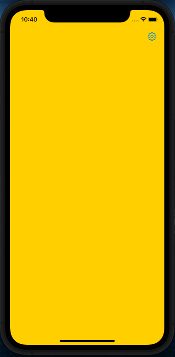
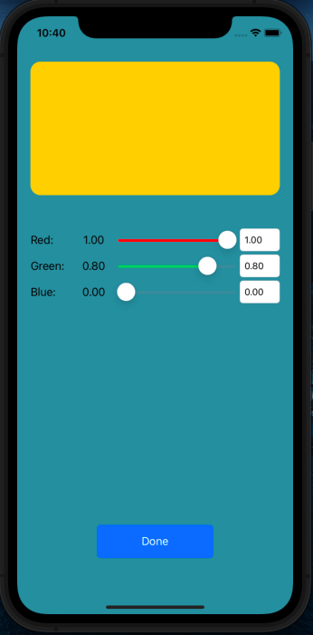

# HomeWork2.6.1
Homework 2 block 6 lesson 1 task

Сделайте экран в котором можно менять цвет фона у вью, при помощи слайдеров. Значение каждого слайдера должно отображаться в соответствующем лейбле. Цвет слайдера слева от бегунка должен соответствовать тому цвету, за который он отвечает.

Добавьте еще один экран и сделайте его стартовым. Второй экран — это экран настроек, в котором можно настроить цвет для первого экрана.

1. При переходе на экран настроек в ColorView нужно передать текущий цвет основного экрана.
2. При закрытии экрана настроек передайте на основной экран приложения цвет выбранный в настройках, используя для этого делегирование.

